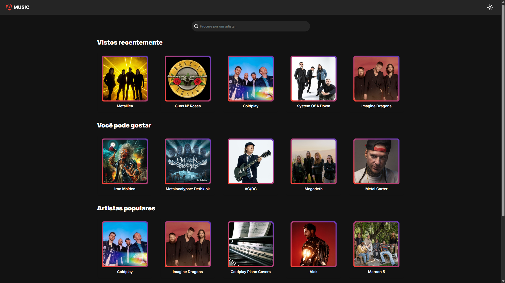

<h1 align="center">Angular Music</h1>

<p align="center">
  
</p>

A simple artist search app built with Angular and the [Spotify API](https://developer.spotify.com).

## Features

- Search for artists
- View your latest searches
- Get recommendations based on your latest searches
- View popular artists
- View artist details
- View artist top tracks
- Visit artist's Spotify page
- View artist albums
- View album tracks
- Listen the track on Spotify

## Getting Started

1. Clone the repository
2. Install the project dependencies using `npm install`
3. Create a `environment.ts` file in the `src/environments` directory and add the Spotify API credentials:

```typescript
export const environment = {
  apiUrl: "https://api.spotify.com/v1",
  clientId: "123abcd",
  clientSecret: "123abcd",
};
```

4. Run the application using `npm run start`
5. Go to `http://localhost:4200` in your browser

## Technologies Used

- [Angular v16](https://v16.angular.io/docs)
- [Spotify Web API](https://developer.spotify.com/)
- [TypeScript](https://www.typescriptlang.org/)
- [SASS](https://sass-lang.com/)
